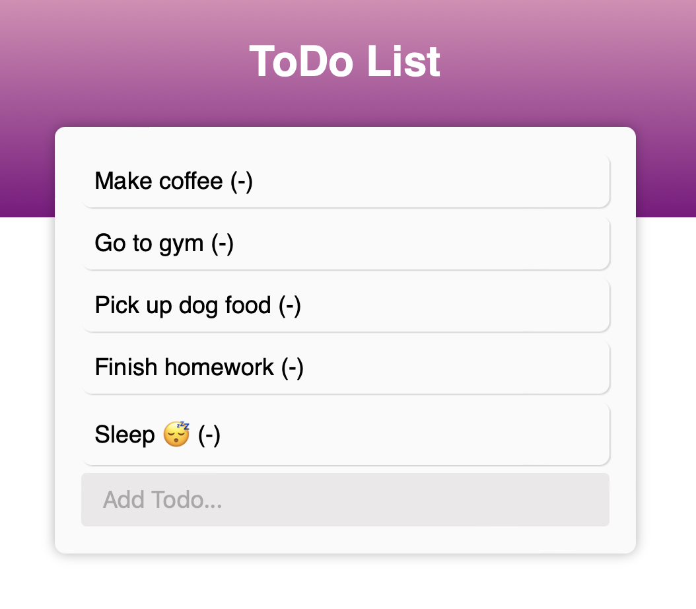

# ToDo-List

## Description
Using starter code provided by the MIT xPRO course and React, we created a ToDo list where the user can input additional todos and delete completed todos by clicking on the task.

## Installing
Clone this repo and open the index.html file in your browser.

## Roadmap
Add a radio button the the left of each task that you can check off when a task is complete.

## Links
<a href="https://github.com/avorwerk98/ToDo-List.git">Link to Repository</a>
<a href="https://avorwerk98.github.io/ToDo-List/">View Live</a>
